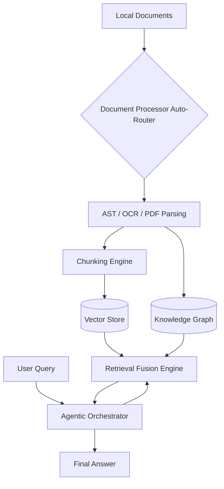

# RAGBox-Core

[](https://badge.fury.io/py/ragbox-core)
[](https://opensource.org/licenses/MIT)
[](https://www.python.org/downloads/)
[](https://github.com/ixchio/ragbox-core/actions/workflows/ci.yml)

**RAG-in-a-Box: Zero-Configuration Self-Building Agentic RAG System**

RAGBox is a production-ready, auto-configuring, async-first RAG engine that combines Vector Search, Agentic Orchestration, and Graph Retrieval natively.

## Installation

```bash
pip install ragbox
```

> **Note on Dependencies:** Advanced document processing features like OCR and complex PDF parsing require system-level dependencies. Depending on your OS, you may need to install standard C++ build tools or Tesseract for `paddleocr` and `pdfplumber` to function optimally.

## Quick Start (3-Line API)

```python
from ragbox import RAGBox

# Automatically ingests, builds graphs, configures vector db, and chunks
rag = RAGBox("./company-docs")

# Intelligent routing via query classification
answer = rag.query("What's our vacation policy?")
print(answer)
```

## CLI Interface

RAGBox provides a dead-simple CLI for running locally without writing code:

```bash
# Point to your documents. RAGBox will self-build the index and graph.
ragbox init ./company-docs

# Query the active index
ragbox query "What's our vacation policy?" -d ./company-docs
```

## Architecture



## Risk Surface Analysis

*   **Temporal Edges (T=0 vs T=Scale):** At T=0, `ragbox init` is blocking to guarantee index availability. At T=scale, the background daemon handles delta updates (via watchdog) to prevent index staleness and thundering herds.
*   **Adversarial Edges:** Subject to standard prompt injection if queries are exposed raw to external users. The Orchestrator currently assumes trusted inputs.
*   **Resource Edges:** High concurrency read/write spikes memory due to dual maintenance of the local Vector DB and the Knowledge Graph.

## Features

* **Self-Healing Infrastructure:** Watchdog auto-detects changes and updates vector stores & knowledge graphs incrementally, preventing index staleness or storms.
* **Auto-Document Intelligence:** Automatically detects PDF, Text, Images, and Code to use AST, OCR (`paddleocr`), or structural layouts (`pdfplumber`).
* **Cost Estimator:** See the expected USD cost of indexing *before* it runs.
* **Auto-Knowledge-Graph (GraphRAG):** Extracts entities and communities automatically using the Leiden algorithm for structured reasoning.
* **Retrieval Fusion & Reranking:** Merges Dense Vectors and Graph Search using Reciprocal Rank Fusion, then reranks the massive candidate pool using a highly accurate `ms-marco` Cross-Encoder.
* **Late Chunking:** Contextual sequence embeddings! Vectors are calculated over the full document bounds before being pooled into chunks, preserving global semantic context within local tokens.
* **Agentic Orchestrator & Intelligent Routing:** Automatically routes incoming queries into 6 distinct pipelines: Vector, Keyword, Graph, Multi-Query, Time-Based, and Agentic.
* **Multi-Query Expansion:** Broad intent queries are dynamically expanded into multiple variations by the LLM, retrieving and fusing results across all variations for unparalleled recall.

## Contributing

We welcome contributions to RAGBox-Core! Please see our [CONTRIBUTING.md](https://github.com/ixchio/ragbox-core/blob/master/CONTRIBUTING.md) for details on how to set up your development environment, run the test suite, and submit Pull Requests.

## License

This project is licensed under the MIT License - see the [LICENSE](https://github.com/ixchio/ragbox-core/blob/master/LICENSE) file for details.
