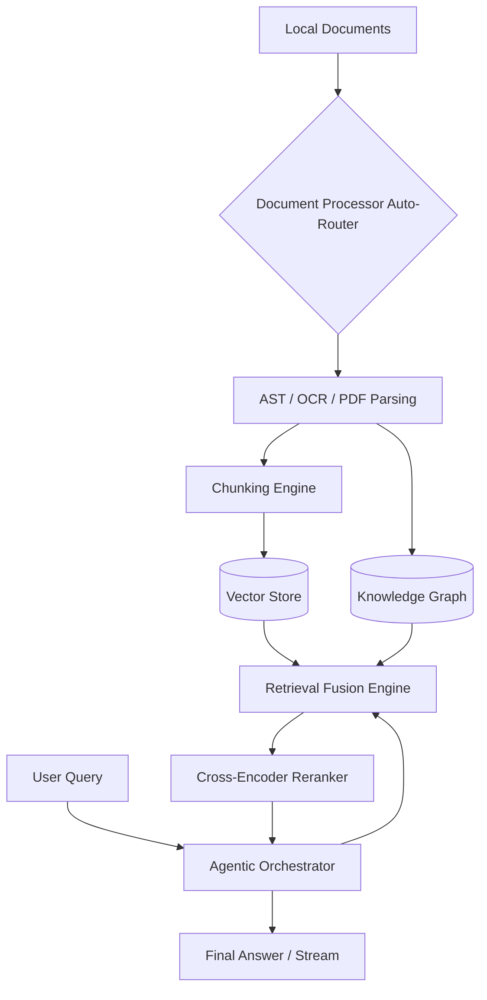

# RAGBox-Core

[](https://badge.fury.io/py/ragbox-core)
[](https://opensource.org/licenses/MIT)
[](https://www.python.org/downloads/)
[](https://github.com/ixchio/ragbox-core/actions/workflows/ci.yml)

**[📚 Read the Official Documentation](https://ixchio.github.io/ragbox-core/)**

**The RAG framework for people who don't want to think about RAG.**

RAGBox is a batteries-included, developer-friendly, async-first RAG engine that combines Vector Search, Knowledge Graphs (GraphRAG), Agentic Orchestration, and Cross-Encoder Reranking — all auto-configured with zero setup.

## Why RAGBox?

| Other Frameworks | RAGBox |
|---|---|
| Wire 15 components together | **3 lines of code** |
| Configure chunking, embeddings, retrievers | **Auto-configures everything** |
| Graph RAG requires separate setup | **Built-in Leiden/Louvain GraphRAG** |
| No reranking by default | **Cross-Encoder reranking included** |
| Token-by-token streaming is extra work | **`astream()` built-in** |

## Installation

```bash
# Core install (~80MB) — all you need to get started
pip install ragbox-core

# Optional extras for advanced features
pip install ragbox-core[ocr]      # PaddleOCR for image text extraction
pip install ragbox-core[local]    # Local LLaMA model support
pip install ragbox-core[server]   # FastAPI server for Docker deployment
pip install ragbox-core[all]      # Everything
```

## Configuration (API Keys)

RAGBox auto-detects cloud providers. Set one environment variable:
```bash
export OPENAI_API_KEY="sk-..."
# OR
export ANTHROPIC_API_KEY="sk-ant-..."
# OR
export GROQ_API_KEY="gsk_..."
```
If no keys are found, RAGBox falls back to a local LLaMA model (requires `pip install ragbox-core[local]` and a GGUF model file).

## Quick Start (3-Line API)

```python
from ragbox import RAGBox

# Auto-ingests, builds knowledge graph, configures vector db, and chunks
rag = RAGBox("./company-docs")

# Intelligent routing via query classification
answer = rag.query("What's our vacation policy?")
print(answer)
```

## Async Streaming

```python
import asyncio
from ragbox import RAGBox

async def main():
    rag = RAGBox("./docs")
    
    # Stream the answer token-by-token
    async for chunk in rag.astream("Summarize the Q4 report"):
        print(chunk, end="", flush=True)

asyncio.run(main())
```

## CLI Interface

```bash
# Build the index and knowledge graph
ragbox init ./company-docs

# Query the active index
ragbox query "What's our vacation policy?" -d ./company-docs
```

## Docker (One-Click Deployment)

```bash
# Instant RAG server
docker run -v ./docs:/data -e OPENAI_API_KEY=$OPENAI_API_KEY -p 8000:8000 ragbox

# Or with docker-compose
docker compose up
```

```bash
# Query the server
curl -X POST http://localhost:8000/query \
  -H "Content-Type: application/json" \
  -d '{"question": "What is our vacation policy?"}'
```

## Architecture



## Features

* **Auto-Everything:** Auto-detects LLM providers, embedding models, vector stores, and document types. Zero configuration needed.
* **Built-in GraphRAG:** Automatically extracts entities and communities using Leiden/Louvain algorithms for structured reasoning over your documents.
* **Streaming:** `async for chunk in rag.astream("question"):` — first-class streaming support across all LLM providers.
* **Retrieval Fusion & Reranking:** Merges Dense Vectors and Graph Search using Reciprocal Rank Fusion, then reranks with `ms-marco` Cross-Encoder.
* **Late Chunking:** Contextual sequence embeddings — vectors are calculated with document-level context, preserving global semantics.
* **Agentic Orchestrator:** Automatically routes queries into Vector, Graph, Multi-Query, or Agentic pipelines based on intent classification.
* **Multi-Query Expansion:** Broad queries are expanded into multiple variations, retrieving and fusing results for better recall.
* **Self-Healing Infrastructure:** Watchdog auto-detects file changes and updates indexes incrementally with debouncing and deduplication.
* **Cost Estimation:** See the expected USD cost of indexing before it runs, powered by tiktoken for accurate token counting.
* **Auto-Document Intelligence:** Handles PDF, Text, Images (OCR), Code (AST), PowerPoint, and more automatically.

## Risk Surface Analysis

*   **Temporal Edges (T=0 vs T=Scale):** At T=0, `ragbox init` blocks to guarantee index availability. At T=scale, the background daemon handles delta updates via watchdog.
*   **Adversarial Edges:** Subject to standard prompt injection if queries are exposed raw to external users. The Orchestrator currently assumes trusted inputs.
*   **Resource Edges:** High concurrency read/write spikes memory due to dual maintenance of the Vector DB and Knowledge Graph.

## Benchmarks

See [BENCHMARKS.md](BENCHMARKS.md) for reproducible comparison results of RAGBox vs vanilla vector search on standard QA datasets.

## Contributing

We welcome contributions to RAGBox-Core! Please see our [CONTRIBUTING.md](https://github.com/ixchio/ragbox-core/blob/master/CONTRIBUTING.md) for details on how to set up your development environment, run the test suite, and submit Pull Requests.

## License

This project is licensed under the MIT License - see the [LICENSE](https://github.com/ixchio/ragbox-core/blob/master/LICENSE) file for details.
